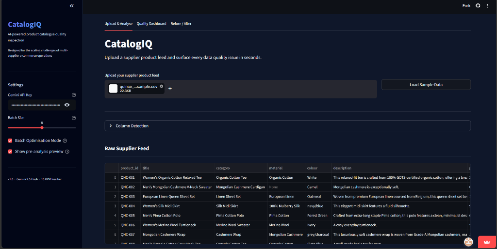
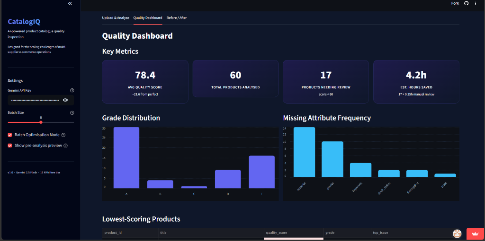
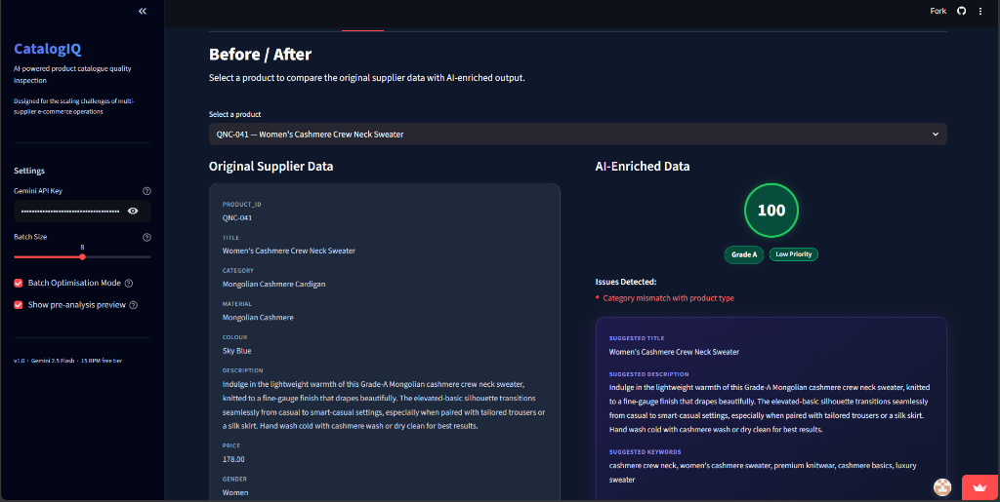

# 🧠 CatalogIQ
**AI-powered product catalogue quality inspection**  
Built to explore how GenAI can scale supplier data validation for multi-supplier e-commerce operations.

[](https://catalogiq.streamlit.app/)
[](https://streamlit.io)
[](https://ai.google.dev)

---

## 🖥️ Live App
**[Try CatalogIQ now →](https://catalogiq.streamlit.app/)**  
*(You will need to supply your own Google Gemini API key via the system sidebar to process data!)*

---

## 📸 Preview

| Upload & Score | Quality Dashboard | Before/After |
|:---:|:---:|:---:|
|  |  |  |

*Feel free to add your own screenshots to the repository and link them here!*

---

## 🔍 What It Does
- **Ingests a raw supplier CSV** – expects columns like `product_id`, `title`, `category`, `material`, `colour`, `description`.
- **Local pre-analysis** – rule-based scoring (checks for missing attributes, short descriptions, ambiguous colours) before hitting the LLM.
- **AI-powered enrichment** – batched requests to Google Gemini 2.5 Flash that return:
  - **Quality Score (0–100) + Grade (A–F)**
  - **Issues** (missing data, vague descriptions, SEO gaps)
  - **AI-suggested title & description**
  - **Suggested keywords**
- **Batch Optimisation Mode** – groups similar items to reduce API calls, avoiding rate limits on free-tier APIs.
- **Enriched CSV export** – download your original data plus all AI-generated columns.
- **Quality Dashboard** – key metrics, grade distribution, missing-attribute frequency, and side-by-side title comparisons.
- **Beautiful UI** – Fully styled dark-mode premium SaaS aesthetic natively integrated into Streamlit.

---

## 🧰 Tech Stack
| Layer | Choice |
|-------|--------|
| Frontend | [Streamlit](https://streamlit.io) |
| Backend logic | Python 3.11+ |
| LLM | Google Gemini 2.5 Flash (free tier) |
| Data processing | Pandas, NumPy |
| Deployment | Streamlit Community Cloud |

---

## 🚀 Running Locally

### 1. Clone the repo
```bash
git clone https://github.com/DEVESH859/CatalogIQ.git
cd CatalogIQ
```

### 2. Install dependencies
```bash
pip install -r requirements.txt
```

### 3. Setup Environment Variables
Create a `.env` file in the root directory (optional).
```bash
GEMINI_API_KEY=your_key_here
```

### 4. Run the app
```bash
streamlit run app.py
```
